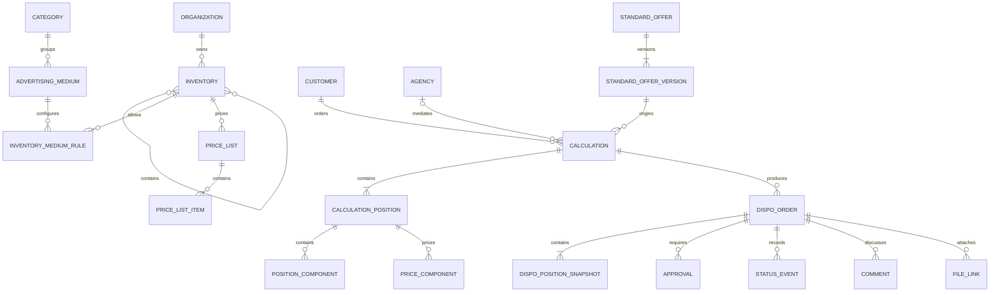

# Fachliches Datenmodell

## Status

Dieses Modell ist fachlich verbindlich, aber noch kein finales physisches
Datenbankschema. Tabellenzuschnitt, Indizes und Framework-Konventionen werden nach
der Technologieentscheidung präzisiert.

## Domänenübersicht

## Stammdaten

### Organisation

V1 enthält genau eine Organisation. Die Organisations-ID bleibt trotzdem an
mandantenrelevanten Tabellen vorgesehen, damit Datenzugriff und spätere Erweiterung
sauber abgegrenzt bleiben.

### Inventar und Kombi-Mitgliedschaft

`Inventory` enthält stabile ID, Name, Kurzcode, Typ, Aktivstatus und Sortierung.
Kombi-Mitgliedschaften werden als Beziehung mit Gültigkeit/Version geführt.
Kombis besitzen eigene Preise; Mitgliedschaften dienen Anzeige und Disposition,
nicht der Preisberechnung (`ORG-002`).

### Oberkategorie und Werbemittel

**ADV-001a (umgesetzt):** Tabelle `advertising_categories` mit stabilem technischen
`key`, fachlichem `name`, `is_active`, `sort`. `AdvertisingMedium` besitzt
verbindliches `category_id` (`restrictOnDelete`). Kanonische Keys:
`spots`, `special_advertising_formats`, `online_audio`, `social_online`,
`events_promotion`, `barter`. Kategorie-IDs sind nicht als fachliche Konstanten
im Anwendungscode zu verwenden; Auflösung über den Key.

**ADV-001b (umgesetzt):** Admin-Lifecycle für Oberkategorien und Werbemittel.
`lock_version` an beiden Tabellen; `advertising_media.sort`. Key/Code nach dem
ersten Speichern unveränderlich. Kein Hard Delete. Deaktivierung statt Löschung.
`spot_classic` nur mit Kategorie-Key `spots` kompatibel. Impact-Preview für
kritische Aktionen. Historische Gen-3-Snapshots bleiben unverändert.

**ADV-001c1 (Schema-Fundament, umgesetzt):** Tabellen `calculation_methods`
(systemseitig literal geseedet: `average`, `calendar`, `fixed_price`, `tkp`,
`free_position`), `advertising_category_calculation_methods`,
`advertising_medium_calculation_methods`. Unique je Ziel+Methode (höchstens ein
`engine_profile_key`, nullable = vorbereitet/nicht buchbar). Am Medium:
`calculation_method_mode` (`inherit`\|`override`, Default `inherit`). Defaults
über nullable `default_calculation_method_id` an Kategorie und Medium (kein
`is_default` in Zuordnungszeilen). Engine-Profile rein codebasiert
(`EngineProfileRegistry`); Dispatch-Vertrag
`(engine_profile_key, calculation_method_key, algorithm_version)`.

**ADV-001c2 (Dual-Read/Write + Freeze, umgesetzt):** An
`calculation_positions` und `dispo_order_positions` die vier Freeze-Felder
`engine_profile_key`, `calculation_method_key`, `calculation_method_name`,
`algorithm_version` (unteilbar: alle gesetzt oder alle `NULL`). Backfill
bekannter Spot-Classic-Average-Positionen auf
`spot_classic`/`average`/`Durchschnitt`/`v1`. Spot-Kategorie erhält Zuordnungen
zu `average`/`calendar`/`fixed_price` mit `engine_profile_key=spot_classic`;
Default `average`; Spot-Medien bleiben `inherit`. Dual-Write schreibt Legacy
(`kind`, `spot_method`) und Freeze gemeinsam über
`CalculationMethodFreezeResolver`. Dispo übernimmt Freeze exakt aus der
Kalkulationsposition. Historische unveränderte Kombinationen nutzen den Freeze
(nicht Live-Katalog/Registry). `advertising_media.kind` nullable; Gen-3
unverändert. Ab c3 (Methoden-Admin) bzw. Legacy-Entfernung ist vollständiger
Schema-Rollback von c2 erwartbar nicht mehr möglich.

**ADV-001c3a (engine-unabhängige Medienpflege, umgesetzt):** Neue Werbemittel
erhalten `kind=null`; `kind` ist im normalen Admin-Payload prohibited und kein
UI-Feld. Legacy-`kind` (Spot Classic) bleibt erhalten; Compatibility nur wenn
gesetzt. Katalogaktivität ≠ technische Buchbarkeit. Zentrale Auswertung
`AdvertisingMediumLiveBookability` für Admin, Wizard-Props und Live-Pfad.
Wizard filtert neue Positionen auf `is_bookable_for_new_positions` (Inventar/
Preisliste bleiben kombinatorisch). Keine Overrides, keine Positions-Methodenwahl.

**ADV-001c3b1 (Methodenstammdaten/-Lifecycle, umgesetzt):** Systemdefinierte
`calculation_methods` mit unveränderlichen Keys; Admin pflegt Name, Hilfetext,
Sortierung. Lifecycle `is_active` nur ohne aktive Zeilen in
`advertising_category_calculation_methods` /
`advertising_medium_calculation_methods` (kein Force, keine Kaskade).
`engine_profile_key` wird im Admin weder gesetzt noch abgeleitet; Registry-Paare
read-only (profil→methode, 0..n). Künftige Assignment-Aktivierungen müssen die
Methode unter Lock auf aktiv prüfen. Keine Migration.

**ADV-001c3b2 (Kategorie-Desired-State):** Atomare Preview/Apply-Pflege der
Kategorie-Methodenzuordnungen und des Defaults. Fehlende Payload-Zeilen
deaktivieren vorhandene Assignments (kein Hard Delete). `engine_profile_key`
nie aus Admin; neu=`null`, bestehende Werte unverändert. Default nur bei
global aktiver Methode, aktiver Desired-Zuordnung, non-null Profil,
Registry `Released` + `current_released_version`. Bestandsschutz bisher
buchbarer Inherit-Medien über LiveBookability-Simulation
(`CategoryMethodCatalogSnapshot`). Lock: Kategorie → Methoden ASC →
Kategorie-Assignments ASC. Identischer State = No-op ohne Mutation/Audit.
Keine Migration.

**ADV-001c3c (Medium-Overrides Desired State):** Atomare Preview/Apply-Pflege
von `calculation_method_mode` (inherit/override), gespeicherten
Medium-Assignments und Medium-Default. inherit: nur Kategorie wirksam;
gespeicherte Overrides bleiben erhalten und unwirksam. override: nur Medium
wirksam, kein Kategorie-Fallback. Kein Hard Delete; `engine_profile_key` nie
aus Admin. Override-Default Released+Profil; gespeicherter Default bei inherit
nur Mitgliedschaft. Bestandsschutz über LiveBookability +
`MediumMethodCatalogSnapshot`. Lock: Medium → Kategorie → Methoden ASC →
Cat-/Med-Assignments ASC. Aktive gespeicherte Medium-Assignments blockieren
c3b1-Deaktivierung auch bei inherit. Keine Migration.

**ADV-001c4a (Methodenoptions-/Freeze-Persistenz):** Serverseitiger
`AdvertisingMediumCalculationMethodOptionsResolver` liefert auswählbare Methoden
(Selectability = `AdvertisingMediumLiveBookability`). Request
`calculation_method_key` presence-aware; `spot_method` Legacy-Alias mit
Konflikt-422. Freeze bytegenau bei unverändertem Medium+Key inkl. reinem
Inventarwechsel; Re-Freeze nur neu / Mediumwechsel / Methodenwechsel.
Wizard-Props additiv (`calculation_method_options`, Freeze-Read); sichtbare
Methoden-UX in **ADV-001c4b**. Budget bleibt average. Keine Migration.

**ADV-001c4b (sichtbare Wizard-Methodenauswahl):** Wizard nutzt c4a-Props für
0-/1-/n-Optionen und historische Freeze-Anzeige. Medienfilter ohne
Spot-Classic-Code-Hardcode. Moderner Payload nur `calculation_method_key`;
`spot_method` bleibt serverseitiger Legacy-Alias. Keine Migration; keine neue
Engine; `calendar`/`fixed_price` weiter planned; Budget ohne Methodenauswahl.

**ADV-001 insgesamt noch offen:** weitere Defaults
(Feldsets, Rabatt/AE/Preisdefaults); Legacy-Felder entfernen; technische
Profil-Provisionierung.

Soll weiterhin: `AdvertisingCategory` liefert Defaults. `AdvertisingMedium` gehört
genau einer Kategorie und ergänzt eigene Regeln. Deaktivierung verhindert
Neuanlage, entfernt aber keine historische Referenz. Keine rückwirkende
Snapshot-Mutation.

### Kombinationstabelle

`InventoryMediumRule` ist die fachliche Whitelist und enthält mindestens:

- Inventar- und Werbemittel-ID,
- Aktivstatus und Sortierung,
- Buchungskennzeichen,
- `Einplanung durch`,
- Hinweistext,
- zulässige Kalkulationsarten,
- Standardlänge und Aufschlag,
- Komponenten-/Allonge-Strategie,
- Rabatt-/AE-Defaults,
- Versions-/Gültigkeitsinformation.

## Preise

`PriceList` bildet Jahr, Version, Status und Gültigkeit ab. `PriceListItem` speichert
den fachlichen Schlüssel, z. B. Inventar, Stunde, Basistagesgruppe und Preisart.

Aktivierung ist atomar: Eine fehlerhafte Importdatei erzeugt keine teilweise aktive
Preisliste. Importdatei und Validierungsbericht werden referenziert.

## CRM-Stammdaten

- `Customer`: Meridian-Nummer und Stammdaten.
- `Agency`: Meridian-Nummer, AE-Standard und Stammdaten.
- `Contact`: mehrere Ansprechpartner je Kunde oder Agentur.
- Rechnungsempfänger: polymorphe Auswahl ausschließlich Kunde oder Agentur.

Eine Kundenkalkulation gehört genau einem Kunden und optional einer Agentur.
Ein Standardangebot hat keine CRM-Bindung.

## Standardangebot

`StandardOffer` ist die kundenlose, sender- bzw. kombibezogene Vorlage.

`StandardOfferVersion` speichert mindestens:

- Versionsnummer,
- Status Entwurf, veröffentlicht oder archiviert,
- Autor,
- Veröffentlichungszeitpunkt bei Veröffentlichung,
- Positions- und Preis-/Produkt-Snapshot,
- Auditbezug.

Vertrieb erzeugt durch Übernahme eine neue `Calculation` mit optionaler Referenz
auf die Ursprungsversion. Die Referenz dient der Nachvollziehbarkeit, nicht der
Synchronisation (`STD-005`). Ein `DispoOrder` darf nur von `Calculation` ausgehen,
nicht von `StandardOffer` (`DSP-007`).

## Kalkulation

### Calculation

- technische ID und sichtbare Kalkulationsnummer,
- Kunde, Agentur, Mediaberater,
- optionale Herkunfts-ID der Standardangebotsversion,
- Kampagne/Produkt/Titel,
- kalkulationsweite Auftragsrabatte und AE-Aktivierung,
- Summen, live aus allen Positionen,
- Konfigurationssnapshot-ID,
- Bearbeitungs-/Archivstatus,
- optimistische Versionsnummer.

Eine Kalkulation kann beliebig viele Positionen unterschiedlicher Inventare
(Sender und Kombis) enthalten (`CAL-001`).

Optionale Budgetdaten (Zielbudget N/N, letzte Verteilungslogik) dürfen an der
Kalkulation gespeichert werden; sie sind keine autoritative Preistabelle. Ein
unstrukturiertes Budget-Textfeld ist unzulässig (`BUD-001`). Der Vorschlag liegt
in `BudgetProposal` und wird erst nach expliziter Übernahme in die Positionen
geschrieben (`BUD-008`).

### CalculationPosition

- Inventar, Werbemittel und Kombination,
- unveränderbare Kalkulationsart,
- Preislisten- und Regelversion,
- Zeitraum/offen,
- Mengen und tatsächliche Länge (Spot Classic: frei editierbares Sekundenfeld je Position, `SPT-015`),
- Preis-, Rabatt-, AE- und Payfaktorwerte,
- Berechnungserklärung,
- Snapshotdaten.

Unterobjekte werden typbezogen normalisiert:

- `PositionComponent` für Spot/SWF-Komponenten,
- `CalculationPositionTimeRange` für Preiszeitraum (Beginn, exklusives Ende,
  Tagesgruppe, Spotanzahl, Sortierung, Snapshot von Ø-Preis und Zeitraumssumme),
- `CalculationPositionDiscount` und `CalculationOrderDiscount` für gestaffelte
  Rabattzeilen (Art, optionale Bezeichnung, Prozent, Sortierung),
- `SpotClassicPlanRow` als Stunden-Snapshot der aufgelösten Preisstunden
  (ohne Kalenderdatum; volle Datumszellen später `PlannerEntry`),
- `PlatformAllocation` für Online-Audio-Mengen,
- `TargetingSelection` für technische/DMP-Targetings,
- `SocialElement` und `InfluencerItem`,
- `PriceComponent` für Produktion, Sonstiges, Fremdkosten und Booster.

## Dispoauftrag

`DispoOrder` referenziert die Ursprungs-**Kundenkalkulation** nur zur Navigation.
Sein Inhalt stammt aus eigenen `DispoPositionSnapshot`-Datensätzen und wird nicht
synchronisiert. Die tatsächliche Spotlänge ist Teil des Positionssnapshots.
Ein Dispoauftrag ohne Kundenkalkulation bzw. direkt aus einem Standardangebot
ist unzulässig.

**Implementiert (September 2026):** Tabellen `dispo_orders`,
`dispo_order_positions`, `dispo_order_number_sequences`,
`dispo_order_approval_requests`. Positionsdaten werden beim Anlegen als Snapshot
in `dispo_order_positions` persistiert. Freigabeanforderungen sind append-only
nach Entscheidung; höchstens eine offene Anforderung pro Auftrag (`open_guard`).
Dispoaufträge speichern `approval_kind` und `special_approval_reasons` als
Snapshot. Kalkulationen speichern zusätzlich `special_approval_reasons` und
`personal_discount_limit_percent` (Grenze zum Speicherzeitpunkt). Eine optionale
Selbstreferenz `revises_dispo_order_id` verknüpft einen Korrektur-Entwurf mit
genau einem abgelehnten Vorgänger (höchstens ein direkter Nachfolger).

**Nummernformat** neue Familien `DA-JJJJ-NNNNN-SS`: Jahr und Stammsequenz entsprechen
der zugehörigen Kalkulationsnummer (`K-JJJJ-NNNNN` → `DA-JJJJ-NNNNN-01`). Weitere
Teilaufträge und Korrekturen erhöhen ausschließlich den zweistelligen Suffix.
Bereits vergebene Dispoauftragsnummern bleiben unverändert; bestehende
Legacy-Familien behalten ihren bisherigen Stamm (historisch oft sechsstellige
Sequenz) und zählen nur den Suffix weiter. Die Tabelle
`dispo_order_number_sequences` bleibt für Legacy-Kompatibilität bestehen, wird
für neue Familien aber nicht mehr verbraucht.

Erreichbare Status in diesem Slice:

- `Entwurf`
- `Wartet auf Vertriebsfreigabe`
- `Liegt bei Disposition`
- `Freigabe abgelehnt` (unveränderbarer, terminaler Snapshot; Nachbesserung nur
  über neuen verknüpften Entwurf)

Zusätzlich vorgesehen, aber noch nicht operativ:

- Priorität, Rechnungsempfänger-/Meridian-Snapshot,
- Ausnahmebestätigungen, zentrale Dateien, Kommentare und weitere Status.

## Dynamische Daten

### DF-1 – Kalkulation (umgesetzt)

Relationale Tabellen für geschützte Systemfelder und Kalkulationswerte:

| Tabelle | Rolle |
|---|---|
| `field_definitions` | stabile Feldidentität (`key`, Typ, Scope, `current_revision_id`) |
| `field_definition_revisions` | unveränderliche Revisionszeilen (Label, Hilfe, Reportflag) |
| `field_sets` / `field_set_versions` | versionierbare Feldsets; Aktivzeiger `active_version_id`; DF-3.1: `lock_version`; DF-3.3-fs: `is_system`, `applies_to`, `is_assignable` (Cores: system + nicht assignierbar; freie Sets: Draft→Activate, Deakt./Reakt.) |
| `field_set_version_fields` | Membership mit `field_definition_id` **und** gepinnter `field_definition_revision_id`; Unique `(field_set_version_id, field_definition_id)` |
| `field_rules` | Regeln der Feldset-Version (`field_equals` / `require_field` in DF-1) |
| `configuration_snapshots` | unveränderlicher Config-Snapshot je Kalkulation (bzw. Legacy-Backfill); ab DF-3.3a2α zusätzlich `format_version` (NOT NULL) und `schema_fingerprint` |
| `snapshot_field_definitions` | snapshot-stabile Felddarstellung und Validierungsbasis; ab DF-3.3a2α mit Property-Provenance |
| `snapshot_field_rules` | kopierte Regeln des Snapshots |
| `calculation_field_values` | typisierte Kopfwerte einer Kalkulation (`value_text` MEDIUMTEXT ab DF-3.2a) |
| `calculation_position_field_values` | typisierte Positionswerte (`value_text` MEDIUMTEXT ab DF-3.2b) |
| `calculations.configuration_snapshot_id` | FK auf den Config-Snapshot der Kalkulation |

Werte liegen typisiert in Spalten (`value_boolean`, `value_period_start`/`end`,
Textfelder, ab DF-3-REST-C1 zusätzlich `value_json` für Choice), nicht als
generisches untypisiertes JSON-Blob. Select speichert einen JSON-String-Key,
Multi-Select ein JSON-Array kanonischer Keys; XOR im Application-Layer.

### DF-2 – Dispoauftrag (umgesetzt)

| Tabelle / Spalte | Rolle |
|---|---|
| `configuration_snapshots.source_configuration_snapshot_id` | Herkunftszeiger Calc→Dispo-Compose (kein Laufzeit-Fallback) |
| `dispo_orders.configuration_snapshot_id` | FK auf den Dispo-Config-Snapshot, nach Backfill **NOT NULL** |
| `dispo_order_field_values` | Header-Werte (`value_text` MEDIUMTEXT, Perioden; DF-3.2a max. 20000 Zeichen) |
| `dispo_order_position_field_values` | Positionswerte (`value_boolean`, Perioden; ab DF-3.2b `value_string`/`value_text`) |

Dispo-Snapshots nutzen Source `dispo_order_create` bzw. `dispo_order_legacy_backfill`.
Legacy-Backfill erzeugt Definitionen **ohne** Dyn-Value-Zeilen (keine erfundenen
historischen Zeitraumwerte). Neue Create-/Revisions-Pfade legen für jedes
Calc-origin-Feld immer eine Capture-Value-Zeile an – auch bei bewusst leerem
optionalem Zeitraum (`NULL`-Spalten). Fehlende Value-Zeile bedeutet „historisch
nicht erfasst“; vorhandene Zeile mit `NULL` bedeutet „erfasst, bewusst leer“.
Draft-Sync erzeugt ausschließlich fehlende Capture-Zeilen und überschreibt keine
vorhandenen Werte.

### DF-3.2a – Custom Header-Textfelder (Feature-Branch)

- `field_definitions.is_active` und Admin-Lifecycle für Custom-Felder.
- Custom nur Header `short_text`/`long_text`; `max_length` in
  `field_definition_revisions.validation_json` (bis 20000).
- Membership Custom in Drafts der beiden Kern-Feldsets; Position-Custom = DF-3.2b.

### DF-3.2b – Custom Position-Textfelder (Feature-Branch)

- Custom Position `short_text`/`long_text`; gleiche `max_length`-Grenzen wie Header.
- `calculation_position_field_values.value_text` → MEDIUMTEXT;
  `dispo_order_position_field_values`: `value_string` (255) + `value_text` (MEDIUMTEXT).
- Calc-Origin-Provenance weiter über Source-Snapshot (kein neues Value-Flag).

### DF-3.3-fs – Freie Feldsets (auf `main`)

- `field_sets.is_system`, `applies_to`, `is_assignable` (NOT NULL nach Backfill; SQLite
  App-seitig erzwungen).
- Cores: `is_system=true`, `is_assignable=false`, feste `applies_to`.
- Freie Sets: Create mit leerem Draft; Assignable erst nach erster Activate;
  Deakt./Reakt. am Container; keine physische Löschung; keine Runtime-Compose-
  Einbindung.
- **DF-3.3-fs-HF1:** Feldset-Deaktivierung blockiert bei aktiven Assignments
  (Invariante: nie `is_assignable=false` mit `field_set_assignments.is_active=true`
  über den Writer-Pfad). Keine Kaskade; Runtime fail-closed unverändert.

### DF-3.3a1 – Field-Set-Assignments (`main`)

- Tabelle `field_set_assignments`: `field_set_id`, `target_layer`
  (`global`|`advertising_category`|`advertising_medium`), nullable Ziel-FKs,
  normalisierte NOT-NULL-`target_identity` (`g`|`c:{id}`|`m:{id}`),
  `applies_to_process`, `is_active`, `sort`, `lock_version`, Timestamps, Audit.
- Unique `(field_set_id, applies_to_process, target_identity)` – echte Eindeutigkeit
  auch für globale Ziele (kein nullable Unique). Ziel-XOR inkl. `target_identity`-
  Gleichheit sowie erlaubte Enum-Werte für Layer/Prozess: MySQL CHECK /
  SQLite BEFORE-Trigger; zusätzlich serverseitig.
- Ungültige Assignment-Quellen (z. B. deaktiviertes Feldset) werden in der normalen
  Kontextvorschau übersprungen und als Warnung ausgewiesen; in Kandidaten-/
  Aktivierungsvorschau blockieren sie.
- FKs `restrictOnDelete`; kein physisches Löschen von Assignments.
- Deterministischer Resolver + Kontext-Preview-API; Activate mit Fingerprint/409.
- In DF-3.3a1 **noch keine** produktive Runtime-Wirkung; die globale Ebene wirkt
  ab `DF-3.3a2α`, Kategorie/Werbemittel und VER-003 ab `DF-3.3a2β`, die
  Assignment-UI ab `DF-3.3b`.
- **PO-33b-1:** neue Assignment-Bindungen nur auf aktive Katalogziele; bestehende
  Assignments mit später deaktiviertem Ziel bleiben lesbar. Katalog-Admin folgte
  als ADV-001b.

### DF-3.3a2α – Snapshot-Generation 2, Quellengraph und Provenance (`main`)

PR #24 / `8edcbd7` (`VER-002`).

**Generationen (`configuration_snapshots.format_version`, NOT NULL ohne DEFAULT):**

| Generation | Bedeutung | Quellen |
|---|---|---|
| 1 | `FORMAT_VERSION_LEGACY` – Altbestand/Legacy-Backfill | nur Kern-Feldset, kein Quellengraph |
| 2 | `FORMAT_VERSION_GLOBAL_FREEZE` – Core + globale Assignments | Quellengraph + Property-Provenance vollständig |
| 3 | `FORMAT_VERSION_CONTEXTUAL_FREEZE` – siehe DF-3.3a2β | Basis Header + Effektiv Position inkl. Kat/Medium |

Bestandszeilen werden per Backfill auf `1` gesetzt; die Migration bricht ab, wenn
danach noch `NULL` übrig ist. Neue Inserts müssen die Generation explizit setzen
(MySQL `NOT NULL` ohne DEFAULT). Lesepfade sind fail-closed: eine unbekannte
`format_version` wird abgewiesen statt still auf einen Default zu fallen.
Generation 1/2 wird **nicht** nachträglich migriert; Updates behalten Snapshot und
Generation.

**Neue Tabellen und Spalten (α):**

| Tabelle / Spalte | Rolle |
|---|---|
| `configuration_snapshots.format_version` | Generationsmarker, NOT NULL |
| `configuration_snapshots.schema_fingerprint` | kanonischer Fingerprint der aufgelösten Konfiguration (Drift-Erkennung) |
| `configuration_snapshot_sources` | Quellengraph: `merge_order`, `layer`, `role` (`core`/`assignment`/`additional`), eingefrorene Feldset-/Versions-/Assignment-Metadaten, `target_layer`/`target_identity` |
| `configuration_snapshot_source_fields` | je Quelle eingefrorene Membership inkl. `required_override`/`visible_override`/`validation_json` |
| `configuration_snapshot_source_rules` | je Quelle eingefrorene Regeln inkl. `dedupe_key` |
| `snapshot_field_definitions.provenance_*_source_id` | Property-Provenance |
| `snapshot_field_rules.provenance_source_id` / `dedupe_key` | Herkunft und Deduplizierung kopierter Regeln |

- Dispo-Revision **klont** den Vorgänger-Snapshot (gleiche `format_version`,
  gleicher Fingerprint, gleiche Keys, geklonte Quellen) statt neu aufzulösen.

### DF-3.3a2β – Snapshot-Generation 3, VER-003 Positions-Effektivs (`main`)

PR #25 / `100c79a`.

| Tabelle / Spalte | Rolle |
|---|---|
| `configuration_snapshots.parent_configuration_snapshot_id` | Effektiv → Basis |
| `configuration_snapshots.context_advertising_*` | sechs Kontextspalten (IDs + Code/Key/Name), FK `restrictOnDelete` |
| `calculation_positions.effective_configuration_snapshot_id` | nullable Unique 1:1 |
| `dispo_order_positions.effective_configuration_snapshot_id` | nullable Unique 1:1 |
| Positions-Denorm (Medium/Kategorie) | Lesepfad ohne Live-Revalidierung |

- Basis friert Header (Core→global) und das Kat-/Medium-Universum ein; Effektivs
  mergen Positionsfelder nur aus dem eingefrorenen Basisgraph.
- Ownership: genau ein Owner in Calc- **oder** Dispo-Positionstabelle; Source passt
  zur Owner-Tabelle; Cross-Table fail-closed.
- Calc→Dispo Gen3 übernimmt den historischen Calc-Effektiv-Kontext (keine
  Live-Ableitung Medium→Kategorie).
- Remap nur per `field_definition_id`; PO-32b-1 (leeres Custom-Pflichtfeld blockiert
  Dispo-Create, nicht Calc).

### Spätere Ausbaustufen

Umgesetzt in DF-3-REST-A (Fundament) und DF-3-REST-B (Options-Admin auf `main`):

- `FieldDefinitionRevisionOption` / Auswahloptionen an Revisionen
- Enum `select` / `multi_select`
- additives Gen3-`options_json`-Freeze
- Options-Admin-UI

Umgesetzt in DF-3-REST-C1:

- additives `value_json` an den vier dynamischen Wertetabellen
  (Laravel `json()`, unter MariaDB wie `options_json` typischerweise `longtext`
  ohne JSON-Validierungs-CHECK)
- `ChoiceFieldValueContract` (Select = JSON-String, Multi = JSON-Array,
  historisch inactive, Leer-/XOR-Vertrag)
- serverseitige Calc-/Dispo-Persistenz, Copy, Completeness; Schema-Props mit
  `options_json`

Umgesetzt in DF-3-REST-C2 (Calc-UI) und C3 (Dispo-UI):

- sichtbare Select-/Multi-Select gegen Freeze-`options_json`
- Dispo: `position_field_schemas` je Effektiv-Snapshot; Calc-Origin read-only
  unter „Aus Kalkulation übernommen“; touched-only Partial-Save

Weiter offen für den DF-3-Abschluss:

- Runtime Visible/Required in Calc-/Dispo-UI (DF-3-RULE-B)
- Regel-Editor (DF-3-RULE-C)
- Gen4 / weitere Regeloperatoren nach Bedarf

Außerhalb DF-3:

- `SystemFieldSetting` / ADV-002

**ADV-001b Katalog-Admin** für Oberkategorien und Werbemittel ist umgesetzt
(Lifecycle, Impact-Preview, kein Hard Delete).

Die Runtime-Auswertung freier Feldsets ist seit `DF-3.3a2α` für die **globale**
Ebene und seit `DF-3.3a2β` für Kategorie/Werbemittel inkl. VER-003 umgesetzt.
Die Assignment-Admin-UI ist seit `DF-3.3b` vorhanden.

JSON darf für unveränderbare Snapshotdarstellung ergänzend genutzt werden, ersetzt
aber nicht die relationalen, filter- und reportrelevanten Werte.

## Benutzer und Rollen

Neben Admin, Vertrieb, Disposition und Geschäftsführung existiert die Rolle
Produktmanagement (`AUTH-006`). Rollen- und Extra-Rechte werden serverseitig
geprüft. Produktmanagement ohne Extra-Recht hat keine Fremdschlüssel-Sicht auf
Kundenkalkulationen oder Dispoaufträge (`AUTH-007`).

## Workflow und Historie

- `Approval`: Typ, Status, Anforderer, Entscheider, Zeitpunkt, Begründung und Grundlage.
- `StatusEvent`: alter/neuer Status, Person, Zeit und Pflichtnotiz.
- `Comment`: append-only, Autor und Zeit.
- `QuestionThread` oder strukturierte Ereignisverknüpfung für Rückfrage/Antwort.
- `AuditEvent`: Objekt, Aktion, alte/neue Werte, Benutzer, Kontext und Korrelations-ID.
- `Notification`: Kanal, Empfänger, Status, Wiederholungen und Fehler.

## Dateien

Dateibytes liegen in einem privaten Laravel-Filesystem-Speicher (V1: lokaler Disk
außerhalb des Webroots; Treiber austauschbar, später S3 ohne Änderung der
Fachlogik). Es gibt keine direkt öffentlichen Datei-URLs; Zugriff nur über
autorisierte Controller oder temporär autorisierte Downloads.
Die Datenbank hält Metadaten, Kategorie, Archivstatus, Prüfsumme, MIME-Typ, Größe,
Uploader und Verknüpfungen. Eine Datei aus einem dynamischen Uploadfeld erscheint
über dieselbe Dateiidentität in der zentralen Uploadliste.

## Übergang Preisstunden und Rabatte

Bestehende Spalten (`total_spot_count`, `position_discount_percent`,
`order_discount_percent`, `ae_percent`, `spot_classic_plan_rows`) bleiben
erhalten, bis alle Lese- und Schreibpfade auf die neuen Tabellen umgestellt
sind. Rückweg: neue Tabellen leeren, Flags zurücksetzen, alte Spalten bleiben
die Quelle.

Migration:

- genau eine Preisstunde → ein Zeitraum `Stunde` bis `Stunde+1` mit der
  bisherigen Gesamtspotzahl;
- mehrere Preisstunden → `needs_spot_redistribution`, keine erfundene
  Spotverteilung, bisherige Durchschnittslogik bis zur manuellen Verteilung;
- vorhandene Prozentwerte → eine Rabattzeile `Sonstiger Rabatt` mit dem
  bisherigen Anzeigenamen;
- explizites AE > 0 → `ae_enabled = true` und gespeicherten Satz behalten;
- neue Kalkulationen → `ae_enabled = false`.

## Technische Invarianten

- Fremdschlüssel und eindeutige fachliche Schlüssel serverseitig erzwingen.
- Vorgangsnummern transaktionssicher vergeben.
- Snapshots nach Erstellung nicht aktualisieren.
- Historien und Kommentare nicht überschreiben oder physisch löschen.
- Geld/TKP/Prozent als Dezimalwerte.
- Jede veränderbare Hauptentität erhält eine Versionsnummer für optimistisches Locking.
- Reportrelevante Fremdschlüssel nicht ausschließlich in unstrukturiertem JSON speichern.

