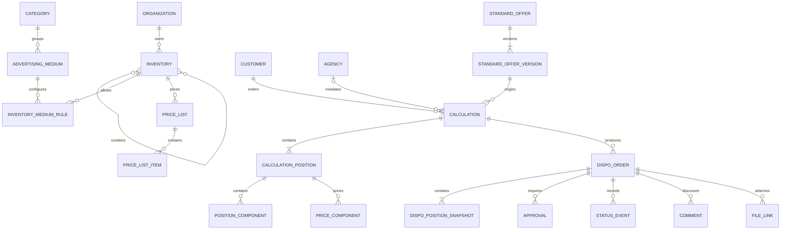

# Fachliches Datenmodell

## Status

Dieses Modell ist fachlich verbindlich, aber noch kein finales physisches
Datenbankschema. Tabellenzuschnitt, Indizes und Framework-Konventionen werden nach
der Technologieentscheidung präzisiert.

## Domänenübersicht

## Stammdaten

### Organisation

V1 enthält genau eine Organisation. Die Organisations-ID bleibt trotzdem an
mandantenrelevanten Tabellen vorgesehen, damit Datenzugriff und spätere Erweiterung
sauber abgegrenzt bleiben.

### Inventar und Kombi-Mitgliedschaft

`Inventory` enthält stabile ID, Name, Kurzcode, Typ, Aktivstatus und Sortierung.
Kombi-Mitgliedschaften werden als Beziehung mit Gültigkeit/Version geführt.
Kombis besitzen eigene Preise; Mitgliedschaften dienen Anzeige und Disposition,
nicht der Preisberechnung (`ORG-002`).

### Oberkategorie und Werbemittel

`AdvertisingCategory` liefert Defaults. `AdvertisingMedium` gehört genau einer
Kategorie und ergänzt eigene Regeln. Deaktivierung verhindert Neuanlage, entfernt
aber keine historische Referenz.

### Kombinationstabelle

`InventoryMediumRule` ist die fachliche Whitelist und enthält mindestens:

- Inventar- und Werbemittel-ID,
- Aktivstatus und Sortierung,
- Buchungskennzeichen,
- `Einplanung durch`,
- Hinweistext,
- zulässige Kalkulationsarten,
- Standardlänge und Aufschlag,
- Komponenten-/Allonge-Strategie,
- Rabatt-/AE-Defaults,
- Versions-/Gültigkeitsinformation.

## Preise

`PriceList` bildet Jahr, Version, Status und Gültigkeit ab. `PriceListItem` speichert
den fachlichen Schlüssel, z. B. Inventar, Stunde, Basistagesgruppe und Preisart.

Aktivierung ist atomar: Eine fehlerhafte Importdatei erzeugt keine teilweise aktive
Preisliste. Importdatei und Validierungsbericht werden referenziert.

## CRM-Stammdaten

- `Customer`: Meridian-Nummer und Stammdaten.
- `Agency`: Meridian-Nummer, AE-Standard und Stammdaten.
- `Contact`: mehrere Ansprechpartner je Kunde oder Agentur.
- Rechnungsempfänger: polymorphe Auswahl ausschließlich Kunde oder Agentur.

Eine Kundenkalkulation gehört genau einem Kunden und optional einer Agentur.
Ein Standardangebot hat keine CRM-Bindung.

## Standardangebot

`StandardOffer` ist die kundenlose, sender- bzw. kombibezogene Vorlage.

`StandardOfferVersion` speichert mindestens:

- Versionsnummer,
- Status Entwurf, veröffentlicht oder archiviert,
- Autor,
- Veröffentlichungszeitpunkt bei Veröffentlichung,
- Positions- und Preis-/Produkt-Snapshot,
- Auditbezug.

Vertrieb erzeugt durch Übernahme eine neue `Calculation` mit optionaler Referenz
auf die Ursprungsversion. Die Referenz dient der Nachvollziehbarkeit, nicht der
Synchronisation (`STD-005`). Ein `DispoOrder` darf nur von `Calculation` ausgehen,
nicht von `StandardOffer` (`DSP-007`).

## Kalkulation

### Calculation

- technische ID und sichtbare Kalkulationsnummer,
- Kunde, Agentur, Mediaberater,
- optionale Herkunfts-ID der Standardangebotsversion,
- Kampagne/Produkt/Titel,
- kalkulationsweiter Rabatt/AE,
- Summen, live aus allen Positionen,
- Konfigurationssnapshot-ID,
- Bearbeitungs-/Archivstatus,
- optimistische Versionsnummer.

Eine Kalkulation kann beliebig viele Positionen unterschiedlicher Inventare
(Sender und Kombis) enthalten (`CAL-001`).

Optionale Budgetdaten (Zielbudget N/N, letzte Verteilungslogik) dürfen an der
Kalkulation gespeichert werden; sie sind keine autoritative Preistabelle. Ein
unstrukturiertes Budget-Textfeld ist unzulässig (`BUD-001`). Der Vorschlag liegt
in `BudgetProposal` und wird erst nach expliziter Übernahme in die Positionen
geschrieben (`BUD-008`).

### CalculationPosition

- Inventar, Werbemittel und Kombination,
- unveränderbare Kalkulationsart,
- Preislisten- und Regelversion,
- Zeitraum/offen,
- Mengen und tatsächliche Länge (Spot Classic: frei editierbares Sekundenfeld je Position, `SPT-015`),
- Preis-, Rabatt-, AE- und Payfaktorwerte,
- Berechnungserklärung,
- Snapshotdaten.

Unterobjekte werden typbezogen normalisiert:

- `PositionComponent` für Spot/SWF-Komponenten,
- `SpotClassicPlanRow` für Preisstunde, Tagesgruppe und Anzahl (dieser Slice
  ohne Kalenderdatum; volle Datumszellen später `PlannerEntry`),
- `PlatformAllocation` für Online-Audio-Mengen,
- `TargetingSelection` für technische/DMP-Targetings,
- `SocialElement` und `InfluencerItem`,
- `PriceComponent` für Produktion, Sonstiges, Fremdkosten und Booster.

## Dispoauftrag

`DispoOrder` referenziert die Ursprungs-**Kundenkalkulation** nur zur Navigation.
Sein Inhalt stammt aus eigenen `DispoPositionSnapshot`-Datensätzen und wird nicht
synchronisiert. Die tatsächliche Spotlänge ist Teil des Positionssnapshots.
Ein Dispoauftrag ohne Kundenkalkulation bzw. direkt aus einem Standardangebot
ist unzulässig.

Zusätzlich:

- sichtbare Nummer und laufende Nummer innerhalb der Kalkulation,
- Gesamtstatus und Priorität,
- Kopfdaten-Snapshot,
- Rechnungsempfänger-/Meridian-Snapshot,
- Freigaben und Ausnahmebestätigungen,
- zentrale Dateien, Kommentare und Historien.

## Dynamische Daten

Konfigurationsobjekte:

- `FieldDefinition`,
- `FieldOption`,
- `FieldSet` und `FieldSetVersion`,
- `FieldSetAssignment`,
- `FieldRule`,
- `SystemFieldSetting`.

Vorgangsdaten:

- `ConfigurationSnapshot`,
- `SnapshotFieldDefinition`,
- `DynamicFieldValue`,
- typisierte Auswahl-/Referenzbeziehungen.

JSON darf für unveränderbare Snapshotdarstellung ergänzend genutzt werden, ersetzt
aber nicht die relationalen, filter- und reportrelevanten Werte.

## Benutzer und Rollen

Neben Admin, Vertrieb, Disposition und Geschäftsführung existiert die Rolle
Produktmanagement (`AUTH-006`). Rollen- und Extra-Rechte werden serverseitig
geprüft. Produktmanagement ohne Extra-Recht hat keine Fremdschlüssel-Sicht auf
Kundenkalkulationen oder Dispoaufträge (`AUTH-007`).

## Workflow und Historie

- `Approval`: Typ, Status, Anforderer, Entscheider, Zeitpunkt, Begründung und Grundlage.
- `StatusEvent`: alter/neuer Status, Person, Zeit und Pflichtnotiz.
- `Comment`: append-only, Autor und Zeit.
- `QuestionThread` oder strukturierte Ereignisverknüpfung für Rückfrage/Antwort.
- `AuditEvent`: Objekt, Aktion, alte/neue Werte, Benutzer, Kontext und Korrelations-ID.
- `Notification`: Kanal, Empfänger, Status, Wiederholungen und Fehler.

## Dateien

Dateibytes liegen in einem privaten Laravel-Filesystem-Speicher (V1: lokaler Disk
außerhalb des Webroots; Treiber austauschbar, später S3 ohne Änderung der
Fachlogik). Es gibt keine direkt öffentlichen Datei-URLs; Zugriff nur über
autorisierte Controller oder temporär autorisierte Downloads.
Die Datenbank hält Metadaten, Kategorie, Archivstatus, Prüfsumme, MIME-Typ, Größe,
Uploader und Verknüpfungen. Eine Datei aus einem dynamischen Uploadfeld erscheint
über dieselbe Dateiidentität in der zentralen Uploadliste.

## Technische Invarianten

- Fremdschlüssel und eindeutige fachliche Schlüssel serverseitig erzwingen.
- Vorgangsnummern transaktionssicher vergeben.
- Snapshots nach Erstellung nicht aktualisieren.
- Historien und Kommentare nicht überschreiben oder physisch löschen.
- Geld/TKP/Prozent als Dezimalwerte.
- Jede veränderbare Hauptentität erhält eine Versionsnummer für optimistisches Locking.
- Reportrelevante Fremdschlüssel nicht ausschließlich in unstrukturiertem JSON speichern.

