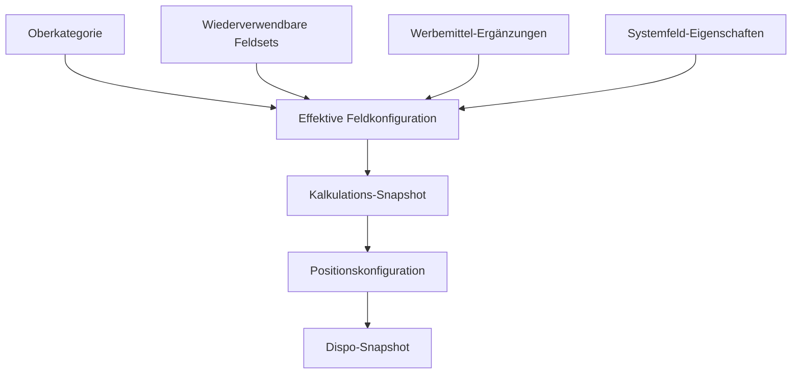

# Dynamisches Feldsystem

## Ziel

Das System kombiniert feste fachkritische Kernobjekte mit administrierbaren
Zusatzfeldern. Berechnungs-, Freigabe-, Status-, Audit- und Snapshotlogik bleiben
Systemlogik. Produktabhängige Zusatzinformationen, Sichtbarkeit, Pflichtregeln und
Validierungen werden konfiguriert.

Verbindliche Anforderungen: `DYN-001` bis `DYN-008`, `VER-001` bis `VER-007`,
`ADM-001` bis `ADM-003`.

## Umsetzungsstand DF-1 (Kalkulation)

Produktiv nutzbare Grundlage ohne Admin-UI:

- Systemfelder: `campaign_period` (Kopf), `period_open` und
  `position_flight_period` (Position).
- Feldset `system_calculation_core` Version 1; Revision über
  `current_revision_id`, Aktivierung über `active_version_id`.
- Neue Kalkulationen materialisieren einen unveränderlichen
  `configuration_snapshot`; Legacy-Kalkulationen erhalten denselben Snapshot
  einmalig per Migration inkl. `period_open = true` je Position.
- Werte liegen in `calculation_field_values` /
  `calculation_position_field_values` (keine festen Perioden-Spalten).
- Serverseitig ausgewertet: `field_equals` + `require_field` auf Snapshot-Regeln
  (`period_open = false` → `position_flight_period` Pflicht).
- Bewusst nicht in DF-1: Admin-Feldeditor, Dispo-Werte,
  `billing_special_features` / `disposition_notes` (DF-2), Custom Fields,
  Optionskatalog, volle Regelmatrix.

## Umsetzungsstand DF-2 (Dispoauftrag)

- Feldset `system_dispo_order_core` mit `billing_special_features` und
  `disposition_notes` (`long_text`, Header, `applies_to=dispo_order`).
- Compose-Snapshot je Dispoauftrag: kopiert Calc-origin-Definitionen/Regeln
  (`campaign_period`, `period_open`, `position_flight_period`) aus dem
  Kalkulationssnapshot und materialisiert die zwei Dispo-Texte aus dem aktiven
  Dispo-Feldset. `field_set_*` zeigt auf `system_dispo_order_core`;
  `source_configuration_snapshot_id` hält die Calc-Herkunft (kein Laufzeit-Lesen).
- Werte in `dispo_order_field_values` / `dispo_order_position_field_values`.
- Draft: Texte editierbar; Calc-origin read-only; Legacy ohne historische Dyn-Werte
  als „nicht erfasst“; Draft-Sync für fehlende Calc-origin-Werte.
- Revision (PO-DF2-1): Texte aus Vorgänger per Schlüssel, Calc-Werte frisch.

## Konfigurationsebenen

Prioritäten und Konfliktauflösung müssen deterministisch sein. Empfohlen ist:

1. Kategorie liefert Defaults.
2. Feldsets ergänzen wiederverwendbare Felder.
3. Werbemittel ergänzt oder überschreibt ausdrücklich erlaubte Eigenschaften.
4. Systemfelder behalten unabhängig von Sichtbarkeit ihre technische Identität.

Die genaue Merge-Reihenfolge wird vor Implementierung als Testfall festgeschrieben.

## Felddefinition

Eine Felddefinition besitzt mindestens:

| Eigenschaft | Bedeutung |
|---|---|
| stabile ID | unveränderbare technische Identität |
| interner Schlüssel | maschinenlesbarer, innerhalb des Kontexts eindeutiger Name |
| sichtbarer Name | versionierter deutscher Anzeigename |
| Feldtyp | bestimmt Speicherung, Eingabe und Validierung |
| Hilfetext | kontextbezogene Unterstützung für Nutzer |
| Gruppe | visuelle und fachliche Gruppierung |
| Reihenfolge | sortierbarer Anzeigewert |
| Aktivstatus | neu verwendbar oder nur historisch sichtbar |
| Pflicht-/Sichtbarkeitsregeln | versionierte Regelausdrücke |
| Validierung | Grenzen und Formatregeln |
| Reporteigenschaften | suchbar, filterbar, gruppierbar oder summierbar |

## Feldtypen V1

- kurzer Text, langer Text
- Zahl, Geldbetrag, Prozent
- Datum, Zeitraum von/bis, Uhrzeit, Monat-Auswahl
- Ja/Nein, Einfachauswahl, Mehrfachauswahl
- URL, E-Mail, Telefon
- Datei-Upload
- Inventar-, Werbemittel-, Ansprechpartner- und Kunden-Auswahl

Jeder Typ besitzt eine klar definierte kanonische Speicherung. Geld und Prozent
werden nicht als formatierter Text gespeichert. Referenzfelder speichern stabile
IDs und zusätzlich im Snapshot die damals sichtbare Bezeichnung.

## Auswahloptionen

Optionen besitzen stabile ID, internen Wert, sichtbaren Namen, Sortierung und
Aktivstatus. Deaktivierte Optionen:

- bleiben in alten Vorgängen lesbar,
- bleiben in Reports historisch gruppierbar,
- sind für neue Werte nicht mehr auswählbar.

## Feldsets

Feldsets sind wiederverwendbare, versionierbare Gruppen, beispielsweise:

- Targeting,
- Reporting,
- Eventdaten,
- Material,
- Social Media.

Statusmodell: `Entwurf → Aktiv → Archiviert`. Änderungen an einer aktiven Version
erzeugen eine neue Entwurfsversion; die aktive Version wird nicht in-place geändert.

## Regelmodell

V1 unterstützt Bedingungen:

- Feld X hat Wert Y,
- Feld X ist oder ist nicht leer,
- Feld X ist größer/kleiner als Y,
- Kombination mehrerer Bedingungen mit UND/ODER.

Aktionen:

- Feld wird sichtbar/unsichtbar,
- Feld wird Pflicht/optional,
- konfigurierter Hinweis oder Validierungsfehler wird ausgelöst.

Regeln referenzieren stabile Feld- und Options-IDs, niemals nur Anzeigenamen.

### Sichtbarkeit und Pflicht

Ein unsichtbares Feld erzeugt standardmäßig keinen Pflichtfehler. Eine Ausnahme ist
nur zulässig, wenn die Regel ausdrücklich unabhängig von der Sichtbarkeit gilt
(`DYN-005`). Beim Unsichtbarwerden eines bereits gefüllten Felds darf der Wert nicht
stillschweigend gelöscht werden; die fachliche Behandlung muss explizit definiert
und getestet sein.

### Initialregeln

| Bedingung | Wirkung |
|---|---|
| Reporting = ja | Reporting-E-Mail sichtbar und Pflicht |
| Targeting gewählt | Targeting-Spezifikation Pflicht |
| Zeitraum offen = nein | Positions-Flugzeitraum Pflicht (`position_flight_period`; DF-1) |
| keine Kundenbestätigung als Upload | Ausnahmegrund Pflicht, sofern Ausnahme genutzt wird |

## Validierungen

- maximale Textlänge,
- Zahl min/max,
- URL-, E-Mail- und Telefonnummernformat,
- erlaubte Dateitypen und Dateigröße,
- Pflicht- und Referenzintegrität.

Das Frontend darf dieselben Regeln für direkte Rückmeldung auswerten. Die endgültige
Entscheidung trifft immer die Serverkomponente bei Speichern und Statuswechsel
(`DYN-004`).

## Snapshot-Lebenszyklus

### 1. Kalkulation anlegen

Die aktive Konfigurationsbasis aus Feldern, Feldsets, Regeln und Systemfeld-
Eigenschaften wird als Kalkulations-Snapshot festgelegt (`VER-002`).

### 2. Position anlegen

Die Position erhält aus dieser Snapshotbasis ihre Werbemittel-, Kombinations- und
Felddefinitionen sowie die gewählte Preislistenversion (`VER-003`).

### 3. Dispoauftrag erzeugen

Der gewählte Kalkulationsstand wird als eigener Dispo-Snapshot gespeichert
(`VER-004`). Es gibt keine automatische Synchronisation zurück oder vorwärts.

## Historische Darstellung

Ein Snapshot muss ohne Zugriff auf die aktuell aktive Definition verständlich
bleiben. Deshalb werden mindestens Schlüssel, Anzeigename, Typ, Optionen,
Formatierung, Regeln/Ergebnisse und relevante Quellversionen snapshot-stabil
aufbewahrt. Alte Feldnamen und deaktivierte Optionen bleiben sichtbar.

## Reporting

Dynamische Werte werden typisiert gespeichert und für Reports normalisiert:

- Zahlen/Geld summierbar,
- Auswahlwerte gruppierbar,
- Texte durchsuchbar,
- Daten als Zeitraumfilter,
- Mehrfachauswahl über einzelne Optionsbeziehungen auswertbar.

Admin kann Reportfähigkeit deaktivieren; diese Entscheidung ist versioniert.

## Admin-Vorschau

Vor Aktivierung zeigt ein Testformular:

- geerbte und eigene Felder in endgültiger Reihenfolge,
- sichtbare/unsichtbare Zustände für Beispielwerte,
- Pflicht- und Validierungsfehler,
- Herkunft jeder Definition und Regel,
- Unterschiede zur aktuell aktiven Version.

