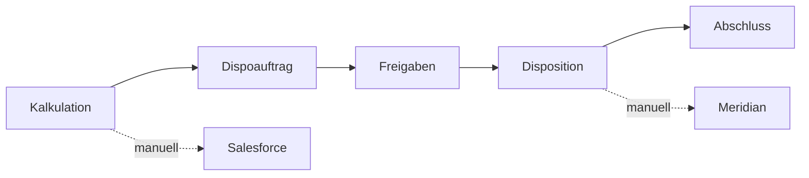

# Fachmodell und Begriffe

## Zweck

Dieses Dokument übersetzt den Anforderungskatalog in ein gemeinsames Domänenmodell.
Es präzisiert Begriffe, erfindet aber keine neuen Fachregeln. Im Konfliktfall gilt
[`anforderungskatalog.md`](anforderungskatalog.md).

## Systemgrenze V1

Das System beginnt bei der internen Kalkulation und endet bei der abgeschlossenen
Disposition. Die eigentliche Buchung in Meridian und die Pflege in Salesforce
erfolgen in V1 manuell außerhalb des Systems.

Nicht Teil von V1 sind Kundenangebote, Kundenportal, historische Datenmigration,
Meridian-/Salesforce-Schnittstellen, Vertreterregeln und komfortable Massenpflege
der Kombinationstabelle. Siehe `SCP-001`, `SCP-002` und Kapitel 3 des
Anforderungskatalogs.

## Kernbegriffe

| Begriff | Verbindliche Bedeutung |
|---|---|
| Organisation | more Marketing als einzige Organisation in V1 |
| Inventar | Buchbare Einheit: Einzelsender, Kombi, digitales oder Event-Inventar |
| Kombi | Eigenständiges Inventar mit eigener Preisliste und Beziehungen zu enthaltenen Sendern |
| Oberkategorie | Übergeordnete Regelquelle für Kalkulationsarten, Felder und Preisverhalten |
| Werbemittel | Konkrete buchbare Leistung innerhalb einer Oberkategorie |
| Kombination | Zulässige Verbindung aus Inventar und Werbemittel mit Buchungskennzeichen, Zuständigkeit, Hinweisen und Regeln |
| Kalkulation | Bearbeitbare kaufmännische Arbeitsgrundlage für genau einen Kunden |
| Kalkulationsposition | Konkrete Leistung mit Inventar, Werbemittel, Kalkulationsart, Preisen und Snapshot |
| Komponente | Sichtbarer Bestandteil einer Position, z. B. Hauptspot, Allonge oder Reminder |
| Zusatzpreiszeile | Produktion, Sonstiges, Fremdkosten oder Boosterbudget innerhalb einer Position |
| Dispoauftrag | Unabhängiger Snapshot ausgewählter Kalkulationspositionen zur operativen Einbuchung |
| Felddefinition | Administrativ definiertes Zusatzfeld mit Typ, Regeln und Reporteigenschaften |
| Feldset | Versionierbare, wiederverwendbare Gruppe dynamischer Felder |
| Snapshot | Unveränderbare fachliche Kopie bzw. Zuordnung der zum Erstellzeitpunkt geltenden Daten und Regeln |
| Mediabrutto | Listenpreis vor Rabatten und AE; nicht mit Umsatzsteuer-Brutto verwechseln |
| N/N-Invest | Kaufmännischer Endinvest nach anwendbaren Rabatten und AE einschließlich relevanter Zusatzzeilen |
| AE | Agenturvergütung; initialer Standard 15 Prozent |
| Payfaktor | Verhältnis N/N-Invest zu Mediabrutto in Prozent |

## Aggregate und Verantwortungsgrenzen

### Kalkulation

Die Kalkulation ist das Aggregat für:

- Kunde, optionale Agentur und Mediaberater,
- Kampagne, Produkt und Titel,
- Kalkulationspositionen und deren Unterobjekte,
- kalkulationsweiten Rabatt und AE,
- Summen und Payfaktoren,
- Konfigurationssnapshot.

Sie darf geändert werden, ohne bereits erzeugte Dispoaufträge zu verändern.

### Kalkulationsposition

Eine Position hält mindestens:

- Inventar und Werbemittel,
- Oberkategorie und erlaubte Kombination,
- unveränderbare Kalkulationsart,
- Preislisten-/Regelversion,
- Zeitraum oder Kennzeichen `Zeitraum offen`,
- Mengen, Komponenten oder Unterpositionen,
- Rabatt-/AE-Eigenschaften und Investitionswerte,
- dynamische Werte und Zusatzpreiszeilen.

### Dispoauftrag

Ein Dispoauftrag enthält Kopfdaten, eine Auswahl von Positionen, zentrale Uploads,
Kommentare, Freigaben und Statushistorie. Er synchronisiert sich niemals automatisch
mit der Ursprungskalkulation (`DSP-003`).

### Administration

Administrierbare Stammdaten, Regeln und Preise werden versioniert. Aktivieren einer
neuen Version verändert ausschließlich zukünftig erzeugte Snapshots (`VER-001` bis
`VER-007`).

## Unverhandelbare Invarianten

1. Jede Kalkulation gehört genau einem Kunden (`CRM-001`).
2. Eine Werbemittelposition referenziert genau eine erlaubte Inventar-Werbemittel-Kombination.
3. Buchungskennzeichen und `Einplanung durch` kommen ausschließlich aus dieser Kombination.
4. Eine Kalkulationsart kann nach Anlage der Position nicht frei gewechselt werden (`CAL-002`).
5. Ein Dispoauftrag ist nach der Erstellung fachlich unabhängig von der Kalkulation (`DSP-003`).
6. Der Ersteller darf keine eigene erforderliche Freigabe erteilen (`AUTH-004`).
7. Historische Snapshots, Auditereignisse und Kommentare werden nicht überschrieben.
8. Kaufmännische Berechnungen sind serverseitig, deterministisch und reproduzierbar (`GEN-001`, `GEN-002`).
9. Ein Auftrag besitzt in V1 genau einen Gesamtstatus (`STA-001`).
10. Die Kombinationstabelle entscheidet, ob ein Werbemittel für ein Inventar überhaupt angelegt werden darf (`MAT-001` bis `MAT-003`).

## Fachliche Identitäten

Interne IDs und sichtbare Nummern werden getrennt behandelt:

- technische IDs sind unveränderbar und nicht fachlich interpretierbar,
- Kalkulations- und Dispoauftragsnummern sind lesbar und transaktionssicher,
- Anzeigenamen dürfen versioniert geändert werden,
- historische Vorgänge zeigen weiterhin ihre gespeicherten damaligen Namen.

Beispiel Dispoauftragsnummer: `DA-2026-000123-01` (`TEC-001`, `TEC-002`).

