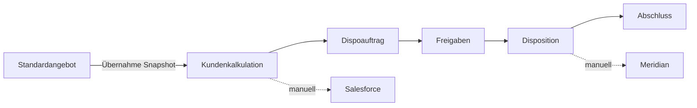

# Fachmodell und Begriffe

## Zweck

Dieses Dokument übersetzt den Anforderungskatalog in ein gemeinsames Domänenmodell.
Es präzisiert Begriffe, erfindet aber keine neuen Fachregeln. Im Konfliktfall gilt
[`anforderungskatalog.md`](anforderungskatalog.md).

## Systemgrenze V1

Das System beginnt bei der internen Kalkulation und endet bei der abgeschlossenen
Disposition. Die eigentliche Buchung in Meridian und die Pflege in Salesforce
erfolgen in V1 manuell außerhalb des Systems.

Nicht Teil von V1 sind Kundenangebote, Kundenportal, historische Datenmigration,
Meridian-/Salesforce-Schnittstellen, Vertreterregeln und komfortable Massenpflege
der Kombinationstabelle. Siehe `SCP-001`, `SCP-002` und Kapitel 3 des
Anforderungskatalogs.

## Kernbegriffe

| Begriff | Verbindliche Bedeutung |
|---|---|
| Organisation | more Marketing als einzige Organisation in V1 |
| Inventar | Buchbare Einheit: Einzelsender, Kombi, digitales oder Event-Inventar |
| Kombi | Eigenständiges Inventar (`type=kombi`) mit eigener Preisliste, eigenen Werbemittelregeln und eigenen Kalkulations-/Dispopositionen; keine gepflegte Sender-Mitgliedschaft in V1 |
| Oberkategorie | Übergeordnete Regelquelle für Kalkulationsarten, Felder und Preisverhalten |
| Werbemittel | Konkrete buchbare Leistung innerhalb einer Oberkategorie |
| Kombination | Zulässige Verbindung aus Inventar und Werbemittel mit Buchungskennzeichen, Zuständigkeit, Hinweisen und Regeln |
| Kalkulation | Bearbeitbare kaufmännische Arbeitsgrundlage für genau einen Kunden; darf parallel mehrere Sender/Kombis enthalten (`CAL-001`) |
| Kalkulationsposition | Konkrete Leistung mit Inventar, Werbemittel, Kalkulationsart, Preisen, tatsächlicher Länge und Snapshot |
| Komponente | Sichtbarer Bestandteil einer Position, z. B. Hauptspot, Allonge oder Reminder |
| Zusatzpreiszeile | Produktion, Sonstiges, Fremdkosten oder Boosterbudget innerhalb einer Position |
| Standardangebot | Versionierte, sender- bzw. kombibezogene Kalkulationsvorlage ohne Kundenbindung (`STD-001`) |
| Budget-Assistent | Optionale, deterministische Mengenvorschläge gegen ein numerisches Zielbudget; keine Reichweiten-/KI-Optimierung (`BUD-*`) |
| Dispoauftrag | Unabhängiger Snapshot ausgewählter Positionen einer Kundenkalkulation zur operativen Einbuchung; nicht aus einem Standardangebot (`DSP-007`) |
| Felddefinition | Administrativ definiertes Zusatzfeld mit Typ, Regeln und Reporteigenschaften |
| Feldset | Versionierbare, wiederverwendbare Gruppe dynamischer Felder |
| Snapshot | Unveränderbare fachliche Kopie bzw. Zuordnung der zum Erstellzeitpunkt geltenden Daten und Regeln |
| Mediabrutto | Listenpreis vor Rabatten und AE; nicht mit Umsatzsteuer-Brutto verwechseln |
| N/N-Invest | Kaufmännischer Endinvest nach anwendbaren Rabatten und AE einschließlich relevanter Zusatzzeilen |
| AE | Agenturvergütung; initialer Standard 15 Prozent |
| Payfaktor | Verhältnis N/N-Invest zu Mediabrutto in Prozent |

## Aggregate und Verantwortungsgrenzen

### Kalkulation

Die Kalkulation ist das Aggregat für:

- Kunde, optionale Agentur und Mediaberater,
- Kampagne, Produkt und Titel,
- Kalkulationspositionen und deren Unterobjekte,
- kalkulationsweiten Rabatt und AE,
- Summen und Payfaktoren, live aus allen Positionen (`CAL-005`),
- optionale Herkunft aus einem Standardangebot-Snapshot,
- Konfigurationssnapshot.

Sie darf geändert werden, ohne bereits erzeugte Dispoaufträge oder das Ursprungs-Standardangebot zu verändern.

### Standardangebot

Das Standardangebot ist ein eigenes Aggregat ohne Kunden- oder Agenturbindung.
Es versioniert sender- bzw. kombibezogene Positionen, Status (Entwurf,
veröffentlicht, archiviert), Autor und Veröffentlichungszeitpunkt. Es erzeugt
keinen Dispoauftrag (`STD-007`).

### Kalkulationsposition

Eine Position hält mindestens:

- Inventar und Werbemittel,
- Oberkategorie und erlaubte Kombination,
- unveränderbare Kalkulationsart,
- Preislisten-/Regelversion,
- Zeitraum oder Kennzeichen `Zeitraum offen`,
- Mengen, Komponenten oder Unterpositionen,
- frei editierbare tatsächliche Spotlänge bei Spot Classic (`SPT-015`),
- Rabatt-/AE-Eigenschaften und Investitionswerte,
- dynamische Werte und Zusatzpreiszeilen.

Klassische Spotpositionen planen Preiszeiträume mit exklusivem Ende und
Spotanzahl je Zeitraum. Der Kalenderplaner bleibt stundenweise und keine gruppierten
Zeitschienen. Trailer, Allongen und weitere SWF aus der Trailerkalkulation dürfen
Standardlängen und gruppierte Zeitschienen nutzen (`SPT-016`, `SWF-008`).

### Dispoauftrag

Ein Dispoauftrag enthält Kopfdaten, eine Auswahl von Positionen, zentrale Uploads,
Kommentare, Freigaben und Statushistorie. Er entsteht nur aus einer Kundenkalkulation
(`DSP-007`) und synchronisiert sich niemals automatisch mit der Ursprungskalkulation
(`DSP-003`). Die tatsächliche Spotlänge jeder übernommenen Spot-Classic-Position
ist im Snapshot ausgewiesen. Eine Kombi erscheint als eigenständige
Inventarposition und wird nicht in enthaltene Sender aufgefächert (`ORG-002`).

### Administration

Administrierbare Stammdaten, Regeln und Preise werden versioniert. Aktivieren einer
neuen Version verändert ausschließlich zukünftig erzeugte Snapshots (`VER-001` bis
`VER-007`).

## Unverhandelbare Invarianten

1. Jede Kundenkalkulation gehört genau einem Kunden (`CRM-001`). Ein Standardangebot hat keine Kundenbindung (`STD-001`).
2. Eine Werbemittelposition referenziert genau eine erlaubte Inventar-Werbemittel-Kombination.
3. Buchungskennzeichen und `Einplanung durch` kommen ausschließlich aus dieser Kombination.
4. Eine Kalkulationsart kann nach Anlage der Position nicht frei gewechselt werden (`CAL-002`).
5. Ein Dispoauftrag ist nach der Erstellung fachlich unabhängig von der Kalkulation (`DSP-003`) und entsteht nicht aus einem Standardangebot (`DSP-007`).
6. Der Ersteller darf keine eigene erforderliche Freigabe erteilen (`AUTH-004`).
7. Historische Snapshots, Auditereignisse und Kommentare werden nicht überschrieben.
8. Kaufmännische Berechnungen sind serverseitig, deterministisch und reproduzierbar (`GEN-001`, `GEN-002`).
9. Ein Auftrag besitzt in V1 genau einen Gesamtstatus (`STA-001`).
10. Die Kombinationstabelle entscheidet, ob ein Werbemittel für ein Inventar überhaupt angelegt werden darf (`MAT-001` bis `MAT-003`).
11. Änderungen an einer aus einem Standardangebot übernommenen Kalkulation ändern das Standardangebot nicht und umgekehrt (`STD-005`).
12. Produktmanagement erhält nicht automatisch Zugriff auf Kundenkalkulationen oder Dispoaufträge (`AUTH-007`).

## Fachliche Identitäten

Interne IDs und sichtbare Nummern werden getrennt behandelt:

- technische IDs sind unveränderbar und nicht fachlich interpretierbar,
- Kalkulations-, Standardangebots- und Dispoauftragsnummern sind lesbar und transaktionssicher,
- Anzeigenamen dürfen versioniert geändert werden,
- historische Vorgänge zeigen weiterhin ihre gespeicherten damaligen Namen.

Beispiel Dispoauftragsnummer: `DA-2026-00005-01` zu Kalkulation `K-2026-00005`
(`TEC-001`, `TEC-002`). Bei einer neuen Dispoauftragsfamilie entsprechen Jahr und
Stammsequenz der zugehörigen Kalkulationsnummer. Weitere Teilaufträge und
Korrekturen erhöhen ausschließlich den zweistelligen Suffix
(`DA-2026-00005-02`, `DA-2026-00005-03`). Bereits vergebene Nummern bleiben
unverändert; bestehende Legacy-Familien behalten ihren bisherigen Stamm.

