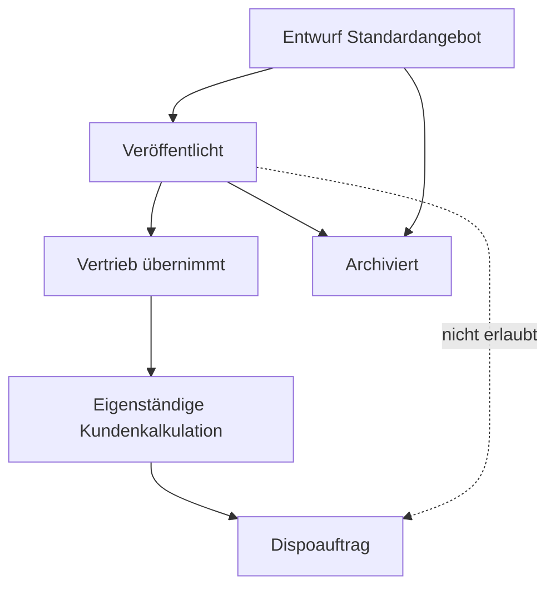
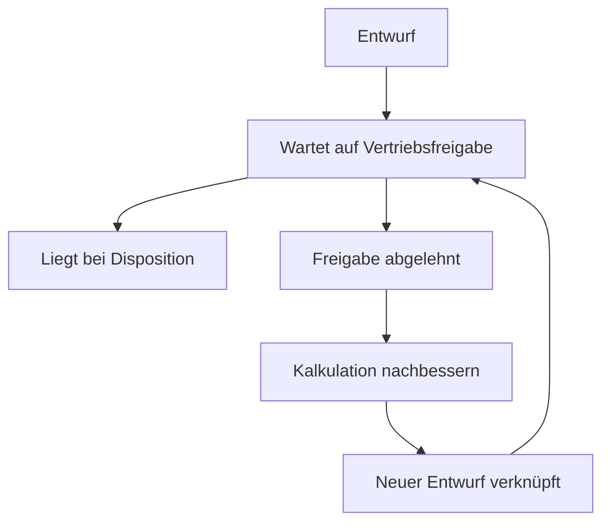

# Workflows und Berechtigungen

## Rollen

| Fähigkeit | Admin | Vertrieb | Disposition | Geschäftsführung | Produktmanagement |
|---|:---:|:---:|:---:|:---:|:---:|
| Alle Kundenkalkulationen und Aufträge sehen | ✓ | ✓ | ✓ | ✓ | nur mit Extra-Recht |
| Kalkulationen anlegen/bearbeiten | ✓ | ✓ | – | ✓ | nur mit Extra-Recht |
| Standardangebote sehen (veröffentlicht) | ✓ | ✓ | – | ✓ | ✓ |
| Standardangebote anlegen/bearbeiten/versionieren | ✓ | – | – | ✓ | ✓ |
| Standardangebote veröffentlichen/archivieren | ✓ | – | – | ✓ | ✓ |
| Standardangebot in Kundenkalkulation übernehmen | ✓ | ✓ | – | ✓ | nur mit Extra-Recht |
| Dispoentwurf anlegen/bearbeiten | ✓ | ✓ | operativ | ✓ | nur mit Extra-Recht |
| Vier-Augen-Freigabe | ✓ | berechtigt, nie eigener Auftrag | – | ✓ | nur mit Extra-Recht |
| Kaufmännische Sonderfreigabe | mit Sonderrecht | nur mit Sonderrecht | – | ✓ | nur mit Extra-Recht |
| Operative Disposition | optional | – | ✓ | ✓ | – |
| Stammdaten und Regeln administrieren | ✓ | – | – | ✓ | Preis-/Produkt-Snapshots für Standardangebote |
| Abschluss erzwingen | ✓ | – | – | ✓ | – |
| Auswerten/exportieren | ✓ | ✓ | rollenbezogen | ✓ | rollenbezogen |

Berechtigungen werden serverseitig über Rollen und zusätzliche Nutzerrechte
geprüft. Geschäftsführung darf alle Vorgänge bearbeiten (`AUTH-003`). Admin und
Geschäftsführung behalten umfassende Rechte. Produktmanagement erhält die
Standardangebotsrechte aus `AUTH-006`, aber nicht automatisch Zugriff auf
Kundenkalkulationen oder Dispoaufträge (`AUTH-007`).

## Standardangebote

Status: Entwurf → veröffentlicht → archiviert. Nur veröffentlichte Versionen
sind für Vertrieb zur Übernahme sichtbar (`STD-002`, `STD-004`).

Übernahme erzeugt einen Snapshot. Änderungen fließen nicht zurück (`STD-005`).
Ein Dispoauftrag entsteht nur aus der Kundenkalkulation (`DSP-007`).

## Vier-Augen-Prinzip

Der Ersteller eines Dispoauftrags darf den eigenen Auftrag niemals genehmigen
oder ablehnen (`AUTH-004`) – auch nicht als Admin oder Geschäftsführung.

### Implementierter Slice (September 2026)

Jeder Dispoauftrag benötigt vor Disposition eine Freigabe. Es gibt keinen
Übergang `Entwurf → Liegt bei Disposition`.

| Art | Genehmigen / Ablehnen |
|---|---|
| Regulär | anderer Vertrieb, Admin, Geschäftsführung |
| Sonderfreigabe | ausschließlich Admin, Geschäftsführung |

Disposition und Produktmanagement entscheiden nicht. Der abgelehnte Dispoauftrag
bleibt als unveränderbarer, terminaler Snapshot erhalten. Der Ersteller kann die
zugrunde liegende Kalkulation nachbessern und daraus einen neuen, verknüpften
Dispoauftrag im Status Entwurf erzeugen.

Freigabeart und Gründe werden beim Anlegen des Dispoauftrags aus der kanonischen
Sonderfreigabelogik als Snapshot gespeichert; spätere Änderungen an
Benutzergrenzen ändern sie nicht. Teilübernahmen bewerten nur den ausgewählten
Umfang; nicht zuordenbare Gründe führen sicherheitshalber zur Sonderfreigabe.

`AUTH-005` (zwei getrennte Freigabeereignisse in einem Bedienvorgang) ist in
diesem Slice **nicht** umgesetzt: Es gibt eine Entscheidung, deren
Rollenanforderung von `regular` vs. `special` abhängt.

## Auslöser einer Sonderfreigabe

Mindestens folgende Fälle lösen eine kaufmännische Sonderfreigabe aus:

- Positionsrabatt überschreitet persönliche Rabattgrenze,
- Auftragsrabatt überschreitet persönliche Rabattgrenze,
- effektiver (kombinierter) Rabatt überschreitet persönliche Rabattgrenze,
- Basis-TKP liegt unter Mindest-TKP (noch nicht implementiert),
- Online-Audio-Festpreis (noch nicht implementiert),
- überschreibender regulärer Produktionspreis (noch nicht implementiert),
- weitere administrativ definierte Freigaberegel.

## Freigabereihenfolge (Slice)

Während einer laufenden Freigabe ist der Auftrag schreibgeschützt. Rückzug einer
offenen Freigabe sowie Überschreiben desselben abgelehnten Snapshots sind in
diesem Slice nicht umgesetzt. Nachbesserung erzeugt immer einen neuen Auftrag.

## Freigabeinvalidierung

Folgende Änderungen setzen bereits erteilte betroffene Freigaben zurück:

- Preise, Rabatte, AE oder Festpreis,
- Kunde, Agentur oder Rechnungsempfänger,
- Positionen, Komponenten, Plattformen, Mengen oder Zusatzzeilen,
- Zeitraum und Rechnungseigenschaften,
- Pflichtfelder oder freigaberelevante dynamische Werte,
- Ersetzen oder Archivieren der Kundenbestätigung.

Kommentare sowie zusätzliche, nicht ersetzende Uploads invalidieren keine
Freigabe. Ursache, alte Freigaben und auslösende Person werden protokolliert.

## Statusmodell des Dispoauftrags

| Status | Verantwortlicher Übergang | Bedingungen / Wirkung |
|---|---|---|
| Entwurf | Vertrieb | frei bearbeitbar; noch nicht eingereicht |
| Wartet auf Vertriebsfreigabe | Vertrieb | Pflichtfelder und Kundenbestätigung/Ausnahme vorhanden (BL-P8-02c: Ausnahmeweg ohne Upload) |
| Freigabe abgelehnt | Freigeber | Begründung Pflicht; Ersteller darf überarbeiten |
| Liegt bei Disposition | System nach Freigabe | vollständige erforderliche Freigaben |
| In Bearbeitung | Disposition / Admin / GF (BL-P8-02a) | bewusste Aktion; keine Automatik |
| Rückfrage Vertrieb | Disposition | Pflichtnotiz; adressiert relevante Vertriebsnutzer (**noch nicht in BL-P8-02a**) |
| Material fehlt | Disposition / Admin / GF (BL-P8-02a) | aktiv gesetzt, nicht automatisch |
| Material erhalten | Disposition / Admin / GF (BL-P8-02a) | aktiv gesetzt, nicht automatisch |
| Disponiert | Disposition / Admin / GF (BL-P8-02a) | fachliche/kaufmännische Daten gesperrt; Wiederöffnung mit Pflichtbegründung |
| Abgeschlossen | Disposition/Admin/GF (Abschluss); Reopen nur Admin/GF (BL-P8-02e) | Abschlussprüfungen oder Admin-Override; Wiederöffnung mit Pflichtbegründung |
| Storniert | Disposition / Admin / GF (PO-BLP802E-1) | Begründung Pflicht; auch nach Disponiert/Abgeschlossen; terminal |

V1 führt nur diesen Gesamtstatus und keine Positionsstatus (`STA-001`).

## Rückfrageprozess

1. Disposition setzt `Rückfrage Vertrieb` mit Pflichtnotiz.
2. Mediaberater, Ersteller, zweiter Freigeber und optional ein weiterer Vertriebsnutzer werden benachrichtigt.
3. Vertrieb antwortet mit Pflichtnotiz.
4. Vertrieb setzt aktiv auf `Liegt bei Disposition` zurück.
5. Frage, Antwort und Übergänge bleiben in Kommentar- und Statushistorie sichtbar.

## Sperren und Wiederöffnen

- Ab `Disponiert` sind fachliche und kaufmännische Daten gesperrt.
- Disposition, Admin oder Geschäftsführung dürfen mit Pflichtbegründung wieder öffnen
  (`disposed` → `in_progress`, BL-P8-02a).
- Kaufmännische Änderungen würden laut STA-003 die erforderlichen Freigaben erneut
  auslösen (**allgemeine Freigabeinvalidierung bleibt separater offener Scope**).
- Nach `Abgeschlossen` dürfen nur Admin oder Geschäftsführung / Management mit
  Pflichtbegründung wieder öffnen (`completed` → `in_progress`, BL-P8-02e /
  PO-BLP802E-1 / STA-004). Disposition/Sales/PM: nein.
- Completed-Reopen invalidiert oder löscht **keine** Freigaben und keine
  Completion-/Approval-/Confirmation-Historie.
- Storno (`→ cancelled`) ist für Disposition/Admin/Management mit Pflichtbegründung
  aus den erlaubten Quellstatusen möglich (inkl. nach Disponiert/Abgeschlossen;
  BL-P8-02e / STA-005 / AT-19). Sales und ProductManagement: nein.
- `cancelled` ist terminal: kein Reopen, kein erneutes Storno.

## Ist-Stand BL-P8-02e (PO-BLP802E-1)

Umgesetzt (manuelle Abnahme separat): Completed-Reopen und Storno/Cancelled.

- Completed-Reopen: nur Admin/Management, `completed → in_progress`, Pflichtgrund,
  Audit `dispo_order.status_reopened`, `is_reopen=true`
- Storno: Disposition/Admin/Management; Quellen: `at_disposition`, `in_progress`,
  `sales_inquiry`, `material_missing`, `material_received`, `disposed`, `completed`
- Nicht aus: `draft`, `awaiting_sales_approval`, `approval_rejected`, `cancelled`
- Dedizierte Services/Endpoints: `DispoOrderCompletedReopenService` /
  `POST …/wieder-oeffnen`, `DispoOrderCancellationService` / `POST …/stornieren`
- Generischer Operational-Endpoint führt diese Kanten **nicht** aus
- AT-19 automatisiert testbar (Feature + Playwright Port **8039**)

Bewusst **nicht** in 02e: File-Upload, BL-P9-01, allgemeine Kommentare,
Notifications, Freigabeinvalidierung, Storno rückgängig.

## Ist-Stand BL-P8-02a (PO-BLP802A-1)

Umgesetzt + manuell abgenommen: bewusste operative Statusübergänge bis Disponiert
inkl. Wiederöffnung, Statushistorie, Rollen Disposition/Admin/GF.

## Ist-Stand BL-P8-02c (PO-BLP802C-1)

Vor Einreichen Draft → `awaiting_sales_approval` muss die Kundenbestätigung
über den Ausnahmeweg gesetzt sein (Checkbox + Pflichtgrund; kein Fake-Upload).
Beim Submit wird der Ausnahmezustand in `dispo_order_approval_requests`
eingefroren. Genehmigen (regular/special) erfordert bei Ausnahme-Snapshot die
explizite Mitfreigabe; Ablehnen nicht. Revision nach Ablehnung erbt die Ausnahme
nicht. Datei-Upload bleibt offen (UPL-001 teilweise). UPL-003 über SalesInquiry
(BL-P8-02b).

## Ist-Stand BL-P8-02b (PO-BLP802B-1)

Umgesetzt: strukturierter Rückfrage-/Antwortprozess.

- Ask: Disposition/Admin/GF aus erlaubten operativen Status → `sales_inquiry`
  mit Pflichtnotiz `question`
- Answer: Sales/Admin/GF → aktiv `at_disposition` mit Pflichtnotiz `answer`
- Append-only `dispo_order_comments` (Typen `sales_inquiry` /
  `sales_inquiry_response`); Statuswechsel weiter über `dispo_order_status_events`
- Keine automatische Wiederherstellung des vorherigen Status
- Kein Empfänger-Picker

Bewusst **nicht** in 02b: allgemeine Kommentare (`CMT-001`), Notifications
(`NOT-001`/`NOT-002`), Uploads, Completed/Cancelled, Rechnung-per-Ende.

## Abschlussbedingungen

Ein Abschluss ist nur zulässig, wenn:

- alle aktuell sichtbaren Pflichtfelder erfüllt sind,
- keine Rückfrage offen ist,
- Rechnung-per-Ende bei konkretem Zeitraum gepflegt ist,
- Kundenbestätigung oder freigegebene Ausnahme vorliegt,
- alle erforderlichen Freigaben gültig sind.

**BL-P8-02d / PO-BLP802D-1:** Serverseitige Completion-Readiness prüft genau diese
fünf Punkte (Frozen Dyn-Felder, offene SalesInquiry, Frozen Period +
`invoice_end_months`, genehmigte 02c-Ausnahme mit Ack, gültige Approved-Freigabe).
Übergang nur bewusst `disposed → completed` (Disposition/Admin/GF).
Admin darf den Abschluss mit Pflichtbegründung erzwingen. Verletzte Prüfungen,
Benutzer und Zeitpunkt werden im Audit gespeichert (`STA-006`). Completed war in
02d terminal; Reopen/Storno folgen in **BL-P8-02e**.

## Dispositionsrechte

Disposition darf operative Felder, Materialstatus, Rechnung-per-Ende und Kommentare
bearbeiten. Kaufmännische Werte werden nicht durch die Disposition korrigiert;
hierfür ist eine Rückfrage an Vertrieb erforderlich.

## Benachrichtigungen

E-Mail und In-App werden mindestens ausgelöst bei:

- Freigabe angefordert, erteilt oder abgelehnt,
- Rückfrage und Antwort,
- Material fehlt oder erhalten,
- disponiert, abgeschlossen oder storniert.

Ein E-Mail-Fehler darf den fachlichen Statusübergang nicht zurückrollen; er wird
protokolliert und erneut versucht (`NOT-002`).

