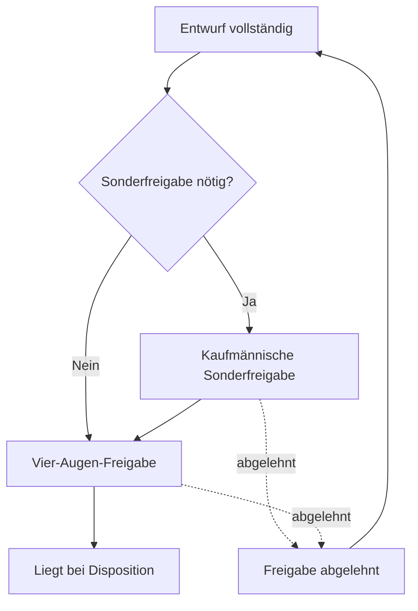

# Workflows und Berechtigungen

## Rollen

| Fähigkeit | Admin | Vertrieb | Disposition | Geschäftsführung |
|---|:---:|:---:|:---:|:---:|
| Alle Kalkulationen und Aufträge sehen | ✓ | ✓ | ✓ | ✓ |
| Kalkulationen anlegen/bearbeiten | ✓ | ✓ | – | ✓ |
| Dispoentwurf anlegen/bearbeiten | ✓ | ✓ | operativ | ✓ |
| Vier-Augen-Freigabe | ✓ | berechtigt, nie eigener Auftrag | – | ✓ |
| Kaufmännische Sonderfreigabe | mit Sonderrecht | nur mit Sonderrecht | – | ✓ |
| Operative Disposition | optional | – | ✓ | ✓ |
| Stammdaten und Regeln administrieren | ✓ | – | – | ✓ |
| Abschluss erzwingen | ✓ | – | – | ✓ |
| Auswerten/exportieren | ✓ | ✓ | rollenbezogen | ✓ |

Berechtigungen werden serverseitig über Rollen und zusätzliche Nutzerrechte
geprüft. Geschäftsführung darf alle Vorgänge bearbeiten (`AUTH-003`).

## Vier-Augen-Prinzip

Der Ersteller darf weder die allgemeine Vertriebsfreigabe noch eine erforderliche
kaufmännische Sonderfreigabe selbst erteilen (`AUTH-004`). Besitzt eine andere
Person beide Freigaberechte, darf sie beide Freigaben in einem Bedienvorgang
erteilen; es entstehen dennoch zwei getrennte Freigabeereignisse (`AUTH-005`).

## Auslöser einer Sonderfreigabe

Mindestens folgende Fälle lösen eine kaufmännische Sonderfreigabe aus:

- effektiver Positionsrabatt überschreitet persönliche Rabattgrenze,
- Basis-TKP liegt unter Mindest-TKP,
- Online-Audio-Festpreis,
- überschreibender regulärer Produktionspreis,
- weitere administrativ definierte Freigaberegel.

## Freigabereihenfolge

Während einer laufenden Freigabe ist der Auftrag schreibgeschützt. Der Ersteller
muss ihn vor einer Änderung zurückziehen (`APR-003`).

## Freigabeinvalidierung

Folgende Änderungen setzen bereits erteilte betroffene Freigaben zurück:

- Preise, Rabatte, AE oder Festpreis,
- Kunde, Agentur oder Rechnungsempfänger,
- Positionen, Komponenten, Plattformen, Mengen oder Zusatzzeilen,
- Zeitraum und Rechnungseigenschaften,
- Pflichtfelder oder freigaberelevante dynamische Werte,
- Ersetzen oder Archivieren der Kundenbestätigung.

Kommentare sowie zusätzliche, nicht ersetzende Uploads invalidieren keine
Freigabe. Ursache, alte Freigaben und auslösende Person werden protokolliert.

## Statusmodell des Dispoauftrags

| Status | Verantwortlicher Übergang | Bedingungen / Wirkung |
|---|---|---|
| Entwurf | Vertrieb | frei bearbeitbar; noch nicht eingereicht |
| Wartet auf Vertriebsfreigabe | Vertrieb | Pflichtfelder und Kundenbestätigung/Ausnahme vorhanden |
| Freigabe abgelehnt | Freigeber | Begründung Pflicht; Ersteller darf überarbeiten |
| Liegt bei Disposition | System nach Freigabe | vollständige erforderliche Freigaben |
| In Bearbeitung | Disposition | aktive operative Bearbeitung |
| Rückfrage Vertrieb | Disposition | Pflichtnotiz; adressiert relevante Vertriebsnutzer |
| Material fehlt | Disposition | aktiv gesetzt, nicht automatisch |
| Material erhalten | Disposition | aktiv gesetzt, nicht automatisch |
| Disponiert | Disposition | fachliche/kaufmännische Daten gesperrt |
| Abgeschlossen | Disposition/Admin/GF | Abschlussprüfungen erfolgreich oder begründeter Admin-Override |
| Storniert | berechtigte Rolle | Begründung Pflicht; auch nach Abschluss möglich |

V1 führt nur diesen Gesamtstatus und keine Positionsstatus (`STA-001`).

## Rückfrageprozess

1. Disposition setzt `Rückfrage Vertrieb` mit Pflichtnotiz.
2. Mediaberater, Ersteller, zweiter Freigeber und optional ein weiterer Vertriebsnutzer werden benachrichtigt.
3. Vertrieb antwortet mit Pflichtnotiz.
4. Vertrieb setzt aktiv auf `Liegt bei Disposition` zurück.
5. Frage, Antwort und Übergänge bleiben in Kommentar- und Statushistorie sichtbar.

## Sperren und Wiederöffnen

- Ab `Disponiert` sind fachliche und kaufmännische Daten gesperrt.
- Disposition, Admin oder Geschäftsführung dürfen mit Pflichtbegründung wieder öffnen.
- Kaufmännische Änderungen lösen die erforderlichen Freigaben erneut aus.
- Nach `Abgeschlossen` dürfen nur Admin oder Geschäftsführung wieder öffnen.
- Storno ist auch nach `Abgeschlossen` möglich und benötigt immer eine Begründung.

## Abschlussbedingungen

Ein Abschluss ist nur zulässig, wenn:

- alle aktuell sichtbaren Pflichtfelder erfüllt sind,
- keine Rückfrage offen ist,
- Rechnung-per-Ende bei konkretem Zeitraum gepflegt ist,
- Kundenbestätigung oder freigegebene Ausnahme vorliegt,
- alle erforderlichen Freigaben gültig sind.

Admin darf den Abschluss mit Pflichtbegründung erzwingen. Verletzte Prüfungen,
Benutzer und Zeitpunkt werden im Audit gespeichert (`STA-006`).

## Dispositionsrechte

Disposition darf operative Felder, Materialstatus, Rechnung-per-Ende und Kommentare
bearbeiten. Kaufmännische Werte werden nicht durch die Disposition korrigiert;
hierfür ist eine Rückfrage an Vertrieb erforderlich.

## Benachrichtigungen

E-Mail und In-App werden mindestens ausgelöst bei:

- Freigabe angefordert, erteilt oder abgelehnt,
- Rückfrage und Antwort,
- Material fehlt oder erhalten,
- disponiert, abgeschlossen oder storniert.

Ein E-Mail-Fehler darf den fachlichen Statusübergang nicht zurückrollen; er wird
protokolliert und erneut versucht (`NOT-002`).

